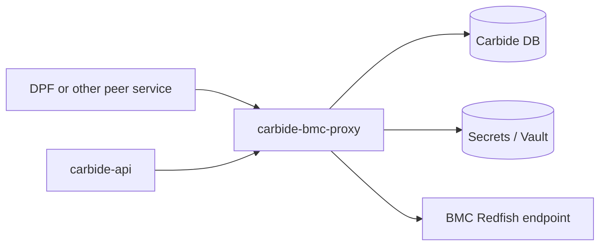
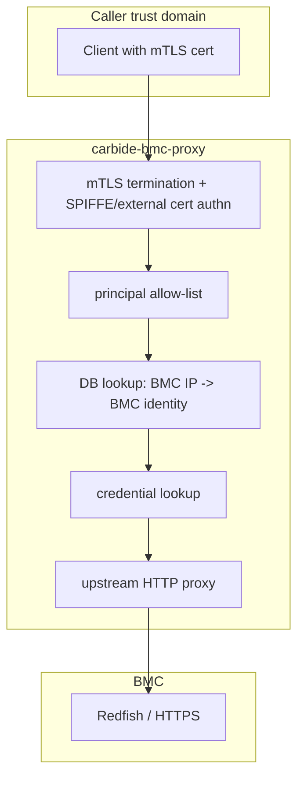
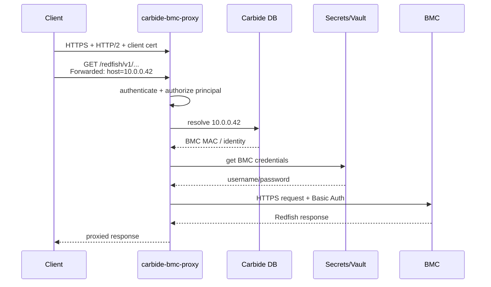

# carbide-bmc-proxy

`carbide-bmc-proxy` is a small authenticated HTTP/2 proxy for BMC access.

Its job is narrow:

- authenticate callers with mTLS
- authorize callers by service principal
- map `Forwarded: host=<bmc_ip>` to a known BMC
- fetch the BMC's admin credentials from the existing secrets layer
- proxy the HTTP request to the target BMC without exposing those credentials to the caller

The point is not to make Carbide a universal facade for every BMC operation. The point is to keep BMC authentication and credential handling in one place, while allowing multiple higher-level systems to coexist as peers.

## Why This Exists

This crate exists because we have at least two valid constraints at the same time:

- Carbide cannot assume it will be the only system that ever talks to BMCs.
- We do not want every system that needs some BMC access to also get direct access to BMC admin credentials.

Those constraints make "just add another Carbide RPC" a poor long-term boundary. If another service only needs access to a constrained set of BMC operations, pushing raw BMC credentials into that service is worse. A dedicated proxy gives us a middle ground:

- one place to authenticate callers
- one place to hold and rotate BMC credentials
- one place to apply shared guardrails later
- no requirement that every BMC consumer be implemented inside `carbide-api`

This is especially relevant for integrations like DPF. The design goal is not "DPF talks through Carbide because Carbide owns everything." The design goal is "Carbide and DPF can both rely on the same credentialed BMC access layer."

## What This Service Is

This service is:

- a common infrastructure component for authenticated BMC access
- a thin HTTP proxy, not a high-level lifecycle management API
- intentionally small and close to the existing Carbide authn/secrets stack

This service is not:

- a claim that arbitrary BMC pass-through is the final architecture forever
- a mechanism for resolving all coordination conflicts between independent management systems
- a replacement for higher-level APIs where those are the right abstraction

If two peer systems can issue conflicting BMC operations, that conflict already exists. This proxy solves the authentication and credential distribution problem cleanly. It does not pretend to solve every multi-controller coordination problem by itself.

## Architecture

Today, the proxy reuses existing Carbide-adjacent building blocks:

- `carbide-authn` for mTLS and SPIFFE principal extraction
- `carbide-secrets` for BMC credential lookup
- the Carbide database to resolve BMC IP to machine/BMC identity

That is a practical implementation choice, not the architectural claim that "Carbide must sit in the middle of all BMC traffic."

### Dependency View



The important point in this picture is that both `carbide-api` and external peers can consume the same proxy. Neither needs direct access to BMC passwords.

### Trust Boundary View



The caller proves who it is with a client certificate. The proxy proves who the target BMC is, retrieves the corresponding credentials, and performs the backend request itself.

## Request Flow

At a high level, a request looks like this:

1. A client connects over HTTPS with HTTP/2 and presents an mTLS certificate.
2. `carbide-authn` validates the certificate chain and extracts principals such as a SPIFFE service identity.
3. The proxy checks that at least one presented principal is listed in `allowed_principals`.
4. The caller indicates the target BMC using `Forwarded: host=<bmc_ip>`.
5. The proxy resolves that IP in the database to the corresponding BMC identity.
6. The proxy fetches the BMC root credentials from the secrets manager.
7. The proxy forwards the original HTTP request to the BMC using HTTPS and backend Basic Auth.
8. The proxy returns the upstream response to the caller.

### Request Sequence



## Current Behavior

The current implementation is intentionally simple:

- listens for HTTPS with HTTP/2
- authenticates clients with mTLS
- supports SPIFFE-based service identity extraction, plus configured external/admin certs
- authorizes requests with a principal allow-list
- requires the target BMC to be supplied via the `Forwarded` header
- looks up per-BMC credentials rather than sharing credentials with callers
- strips hop-by-hop headers before proxying
- limits request bodies to 8 MiB
- exposes a separate metrics endpoint

Notably, this crate currently does not implement a Redfish path allow-list of its own. If we want endpoint-level restrictions for specific consumers, that should be added explicitly and documented as policy, not implied.

## Why A Proxy Instead Of More Carbide APIs

There are cases where a high-level Carbide API is clearly the right answer. This crate is for the opposite case: when another system already operates in terms of a device-native API such as Redfish, but we still need centralized authentication and credential handling.

Using a proxy for that case has a few advantages:

- it avoids proliferating service-specific BMC password access
- it avoids baking another product's raw BMC use cases into `carbide-api`
- it lets Carbide and peer systems consume the same access layer
- it gives us a clean place to add shared controls later, such as rate limits, auditing, or stronger authorization policy

This is also why this crate was split out of `crates/api`: making the proxy a separate binary and separate crate makes the boundary explicit.

## Configuration

The binary is started with:

```bash
cargo run -p carbide-bmc-proxy -- --config-path /path/to/bmc-proxy.toml
```

Important configuration fields:

- `listen`: proxy listen address, default `[::]:1079`
- `metrics_endpoint`: metrics listen address, default `[::]:1080`
- `database_url`: PostgreSQL connection string used to resolve BMC IPs
- `allowed_principals`: authorized caller principals, for example `spiffe-service-id/<name>`
- `tls.*`: server certificate, key, and trust roots for mTLS
- `auth.trust.*`: SPIFFE trust domain and allowed base paths
- `auth.cli_certs`: optional criteria for externally issued admin/client certs
- `bmc_proxy`: optional upstream override for dev/test chaining

Example shape:

```toml
listen = "[::]:1079"
metrics_endpoint = "[::]:1080"
database_url = "postgres://..."
allowed_principals = ["spiffe-service-id/dpf"]

[tls]
identity_pemfile_path = "/var/run/secrets/spiffe.io/tls.crt"
identity_keyfile_path = "/var/run/secrets/spiffe.io/tls.key"
root_cafile_path = "/var/run/secrets/spiffe.io/ca.crt"
admin_root_cafile_path = "/etc/forge/carbide-bmc-proxy/site/admin_root_cert_pem"

[auth.trust]
spiffe_trust_domain = "forge.local"
spiffe_service_base_paths = ["/forge-system/sa/", "/default/sa/"]
spiffe_machine_base_path = "/forge-system/machine/"
additional_issuer_cns = []
```

## Example Request

```bash
curl --http2 \
  --cert /path/to/tls.crt \
  --key /path/to/tls.key \
  -H 'Forwarded: host=192.168.192.8' \
  https://bmc-proxy.example/redfish/v1/Systems/Bluefield
```

The client chooses the BMC by IP. The proxy performs authentication, credential lookup, and backend authentication.

## Operational Notes

- The proxy trusts client certs from the configured SPIFFE root and optional admin root.
- Backend BMC TLS verification is currently disabled in the reqwest client. That matches current pragmatic behavior for BMC environments, but it is a security tradeoff worth tightening over time.
- TLS material for the listener is refreshed periodically without redesigning the service.
- The proxy only knows how to reach BMCs that exist in the database and have credentials in the secrets manager.

## Future Direction

This crate is meant to be a clean boundary, not the final word on implementation technology.

If we later decide to move the proxying layer behind Envoy or another dedicated proxy stack, the core architectural idea should stay the same:

- callers authenticate once
- BMC credentials remain centralized
- Carbide is not forced to be the only BMC-facing system
- peer systems consume a common access layer instead of each handling secrets independently

That is the real value this crate is trying to establish.
